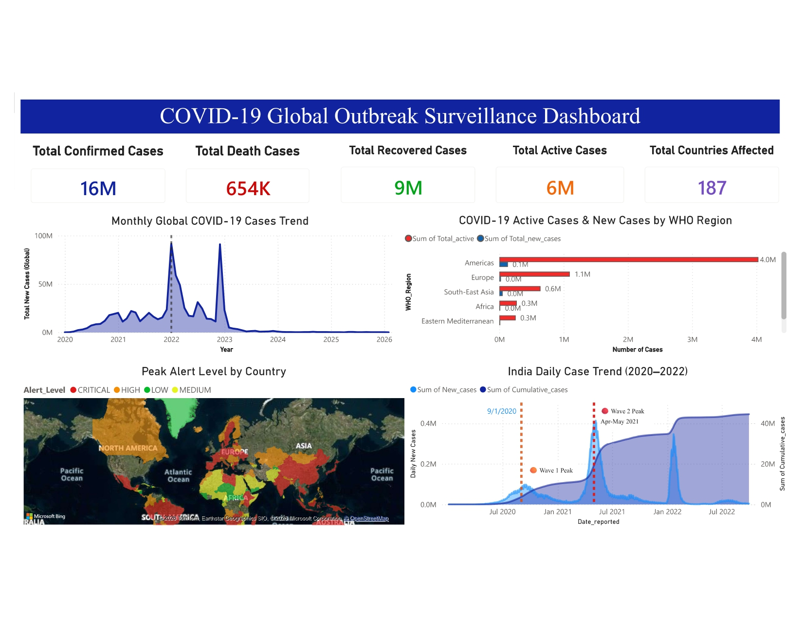
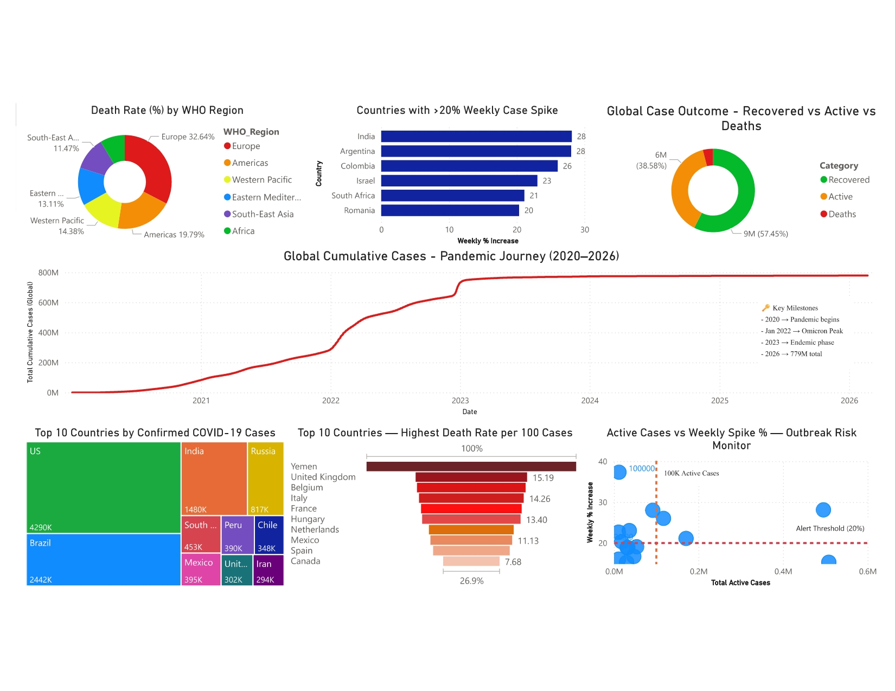

#  Global COVID-19 Data Analysis & Outbreak Monitoring System

> A SQL-based outbreak monitoring system built on real-world WHO health 
> surveillance data to detect trends, classify risk levels, and identify 
> high-risk regions across 187 countries.


##  Project Overview

This project implements a **SQL-based disease outbreak monitoring system** 
that analyzes real-world COVID-19 surveillance data to support 
public health decision-making.

**Core Capabilities:**
- Detection of outbreak patterns and transmission trends
- Country-level alert classification (CRITICAL / HIGH / MEDIUM / LOW)
- High-risk region identification using weekly spike threshold analysis
- End-to-end visualization of the pandemic journey from 2020 to 2026

> This system is designed to be extensible — the same framework can be 
> applied to monitor future outbreaks of emerging infectious diseases 
> or regional health crises beyond COVID-19.


##  Datasets Used

| Dataset | Source | Size |
|---|---|---|
| WHO Global Daily Data | [WHO Official](https://data.who.int/dashboards/covid19/data) | 538,080 rows |
| Country Wise Latest Snapshot | [Kaggle](https://www.kaggle.com/datasets/imdevskp/corona-virus-report) | 187 countries |


##  Tools & Technologies

| Tool | Purpose |
|---|---|
| MySQL 8.0 | Database design, query execution, views |
| MySQL Workbench | SQL development environment |
| Power BI Desktop | Interactive dashboard & visualization |
| WHO / Kaggle | Real-world open-source datasets |


##  Database Structure

```sql
Database: mysqlproject1
│
├── who_daily        
│   └── 538,080 rows — Daily country-level case & death tracking
│       Columns: Date_reported, Country, WHO_region, 
│                New_cases, Cumulative_cases, 
│                New_deaths, Cumulative_deaths
│
└── country_latest   
    └── 187 rows — Latest outbreak snapshot per country
        Columns: Country_Region, Confirmed, Deaths, Recovered,
                 Active, New_cases, One_week_pct_increase, WHO_Region
```


##  SQL Queries Covered

###  Data Quality & Validation
- NULL value detection across both tables
- Duplicate record identification
- Data integrity check — cumulative vs confirmed case mismatch

###  Trend Analysis
- Month-wise global case trend (2020–2026)
- Daily case progression for India — Wave 1 & Wave 2
- Running total of global cases using window functions
- Top 5 worst weeks by global case volume
- Peak month identification (Omicron — Jan 2022)

###  Alert System & Risk Classification
- Peak alert level classification by country
- Weekly spike detection (>20% threshold trigger)
- Active outbreak monitoring (high active + rising trend)
- Same-day death ratio signal (CRITICAL / WARNING / NORMAL)

###  Mortality & Recovery Analysis
- Death rate per 100 cases — country level
- Death distribution across WHO regions
- Best recovery rate countries
- Active case burden vs recovery efficiency

###  Multi-Table JOIN Analysis
- WHO daily trend joined with latest snapshot (SEAR region)
- Cross-dataset data quality validation

###  SQL View
- `outbreak_summary` — Aggregated regional view for health officers


##  Alert Classification Logic

```sql
CASE
    WHEN New_cases > 50000 OR One_week_pct_increase > 30 
         THEN 'CRITICAL'  🔴
    WHEN New_cases > 10000 OR One_week_pct_increase > 20 
         THEN 'HIGH'      🟠
    WHEN New_cases > 1000  OR One_week_pct_increase > 10 
         THEN 'MEDIUM'    🟡
    ELSE 'LOW'            🟢
END AS Alert_Level
```

This logic powers both the **world map visual** and the 
**scatter chart risk monitor** in the dashboard.


##  Power BI Dashboard

### Page 1 — Global Overview
| Visual | Chart Type | Purpose |
|---|---|---|
| Global Summary | 5 KPI Cards | Confirmed, Deaths, Recovered, Active, Countries |
| Monthly Trend | Line Chart | Pandemic wave detection 2020–2026 |
| WHO Region Comparison | Clustered Bar | Regional active & new case burden |
| Alert Level Map | Filled Map | Country-level CRITICAL/HIGH/MEDIUM/LOW |
| India Case Trend | Area Chart | Wave 1 (Sep 2020) & Wave 2 (May 2021) |

### Page 2 — Deep Dive Analysis
| Visual | Chart Type | Purpose |
|---|---|---|
| Death Rate by Region | Donut Chart | Europe 6.40% stands out |
| Weekly Spike Countries | Bar Chart | >20% alert threshold exceeded |
| Case Outcome Split | Donut Chart | Recovered vs Active vs Deaths |
| Cumulative Journey | Line Chart | 0 to 779M — full pandemic story |
| Top 10 Countries | Treemap | USA, Brazil, India dominance |
| Highest Death Rate | Funnel Chart | Yemen → Canada healthcare inequality |
| Outbreak Risk Monitor | Scatter Chart | Active cases vs weekly spike % |


##  Key Findings

*  COVID-19 affected **187 countries** with over **16.4 million confirmed cases** in this dataset snapshot
*  **Omicron (January 2022)** represented the global peak — **91.7 million cases in a single month**
*  **India's second wave (May 2021)** reached **400,000+ daily cases** — the highest single-country surge in Asia
*  **Europe** recorded the highest regional death rate at **6.40%** per 100 confirmed cases
*  Globally, **57% of cases recovered** — however recovery rates vary significantly by region
*  **Americas** carried the highest active case burden at **4 million+ active cases**
*  From mid-2023, global daily cases fell below **10,000** — marking the transition to endemic phase
*  Weekly batch reporting patterns and data inconsistencies highlight the importance of **data quality validation** in surveillance systems


##  Future Scope

> "The monitoring framework developed here can be directly applied to 
> real-time disease surveillance and early warning systems in public health."

-  Real-time data pipeline integration with live WHO feeds
-  Automated alert notifications to district health officers
-  Framework extension to Dengue, Monkeypox, and Influenza monitoring
-  District-level granularity for India-specific health surveillance
-  Machine learning integration for predictive outbreak forecasting
-  Integration with hospital capacity and healthcare resource data


## 📸 Dashboard Preview

### Page 1 — Global Overview


### Page 2 — Deep Dive Analysis



##  Author

**Name:** Subhasri

**Email:** ktsubhasri2005@gmail.com

**GitHub:** [SubhasriiT](https://github.com/SubhasriiT)

**LinkedIn:** [LinkedIn Profile](https://www.linkedin.com/in/subhasri-t-007b58282/)


## 📜 License
This project uses open-source data from WHO and Kaggle for 
educational and research purposes only.
